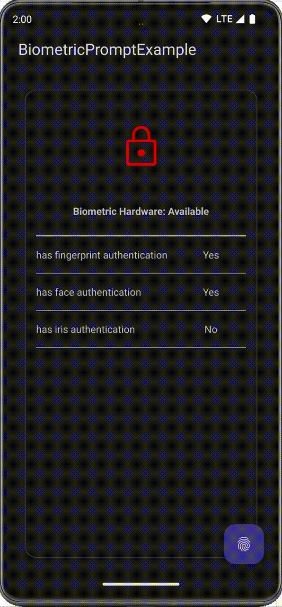
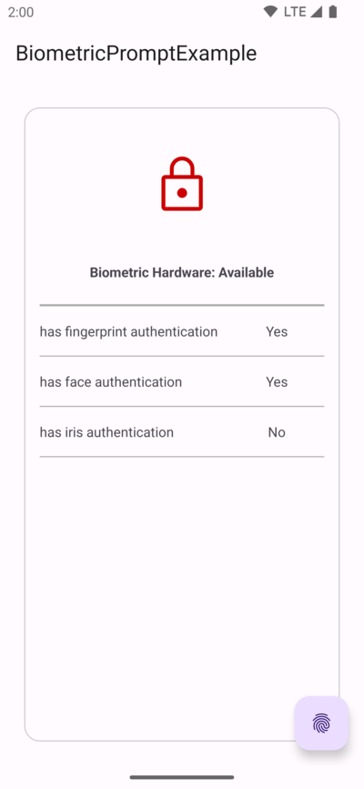
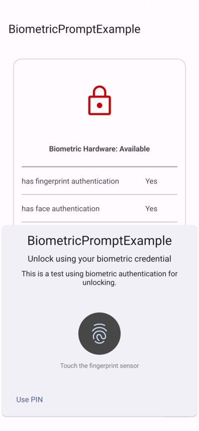
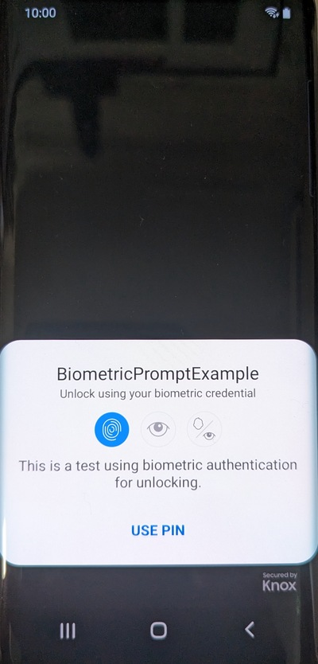

# BiometricPromptExample

This is a simple example using AndroidX's BiometricPrompt.

### Screenshots :

### Development environment :

- Android Studio Giraffe | 2022.3.1
- TargetSdkVersion 34
- androidx.biometric:biometric:1.1.0
